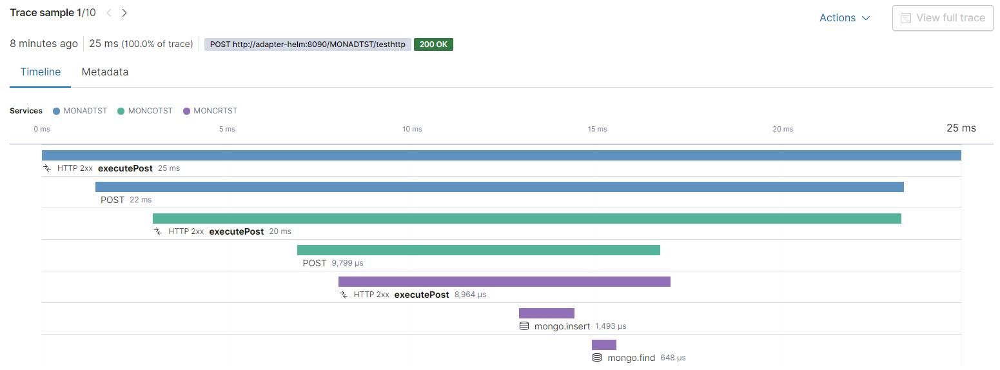

# elasticsearch full monitoring platform

This repo contains de source code for running a Pulumi script that deploys full elasticstack + an application workload for apm and distributed tracing monitoring.

## Execute

### Pulumi

Pulumi is a modern IaC based on Hashicorp´s Terraform. 

Its mainly used for cloud provisioning but in this case we will be using just the kubernetes provider for deploying our stack on a given kube/config

To simply run the scrip you will need following tools:

- Helm 
- Pulumi
- Nodejs
- kubectl 

By default pulumi run the stack against your local .kube/config. Your config should be pointing the kubernetes cluster

Then you should login on pulumi and create your account. Then:

```
pulumi login
pulumi up
```

An stack name may be required, type a name if prompted

It will preview the stack to be deployed and prompt for confirmation

### Docker

I made a docker image so you dont need to install so much tools.

Only needed is a kube/config pointing to the desired kubernetes cluster

Simply run:

```
docker run -v ${HOME}/.kube:/usr/multicloud/kube iiglesias/multicloud-sandbox:0.1.0
```

The dockerfile is included in this repo


## WHAT IS DEPLOYED

### ECK

- elasticsearch database cluster
- elastic APM collector
- kibana 

### Elastic tools

- logstash
- MetricBeats
  - k8s
  - Infra
  - Mongo
  - elastic cluster health

### Application Workload

This workload if composed by 3 services  



```
curl --header "Content-Type: application/json" --request POST http://{ADAPTER_IP}}:8090/MONADTST/testhttp -d @body.json
```

Where the body


```
{
    "adapter":{
            "msg": "adapter",
            "statusCode": 200,
            "delayMillis": 1,
            "encapsulateError" : false
    },
    "composite":{
            "msg": "composite",
            "statusCode": 200,
            "delayMillis": 200, 
            "encapsulateError" : false
    },
    "core": {
            "msg": "core",
            "statusCode": 200,
            "delayMillis": 3,
            "encapsulateError" : false
    }
}
```

### Mongodb

Core service will perform insert and querys on a mongodb

### INGRESS-CONTROLLER + CERT-MANAGER

Just a minimal configuration for exposing the workload throught TLS by creating ingress manifest.

It is intended to serve ACME certificates once an fqdn is assigned to the Nginx. By default clusterIssuers will be created but only selfsigned certificates are issued.

```
sudo vi /etc/hosts
# Add load balancer´s ip for the ingress host spec
104.155.22.7	adapter.multicloud.inditex.com
```

```
curl -kv https://adapter.multicloud.inditex.com/MONADTST/amiga/healthcheck
```

```
# For a different clusterIssuer update the ingress manifest
apiVersion: networking.k8s.io/v1beta1
kind: Ingress
metadata:
  name: adapter-helm
  annotations:
    kubernetes.io/ingress.class: nginx
    cert-manager.io/cluster-issuer: selfsigning-issuer
spec:
  tls:
  - hosts:
    - adapter.multicloud.inditex.com
    secretName: tls-secret
  rules:
  #- host: adapter.multicloud.inditex.com
  - http:
      paths:
      - backend:
          serviceName: adapter-helm
          servicePort: 8090
        path: /MONADTST
```

### Load Generator

Once the cluster is created a Kubernetes Job will perform load request to our demo workload.

This load Generator it is based on Vegeta and will be generating distributed traces for the first 15 mins.


## KIBANA

Not everything is automated, some instructions must be followed to make the full platform running

### Login

```
kubectl get secret quickstart-es-elastic-user -o yaml
## Decode the base64 value of elastic user
echo "OE1xNTJwVmkycEJvUlk0MXh5MjdlZDk0" | base64 -d
kubectl port-forward svc/quickstart-kb-http 5601:5601
```

Type https://localhost:5601 on your browser

- User: elastic
- password: ${DECODED_BASE64}

### Check elasticsearch index and reload them


### Create kibana index

- logstash-*
- metrics-* 
  - Our application workload is using this index for Micrometer


### Stack Monitoring


